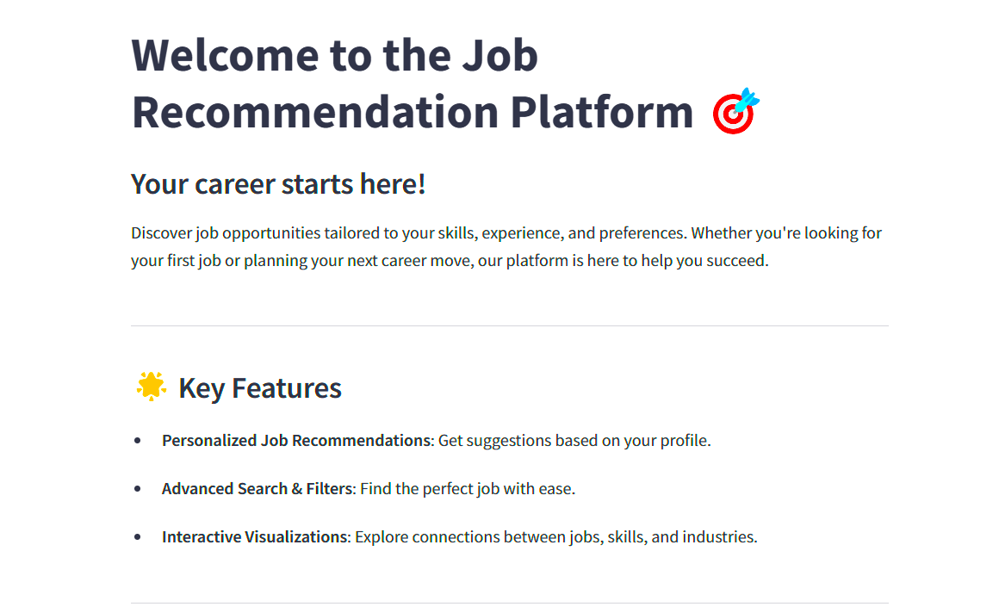
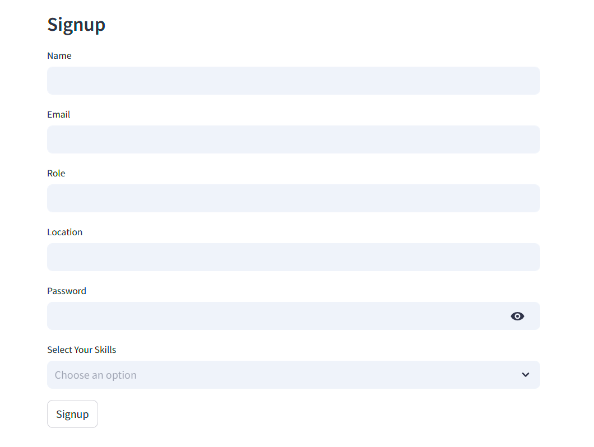
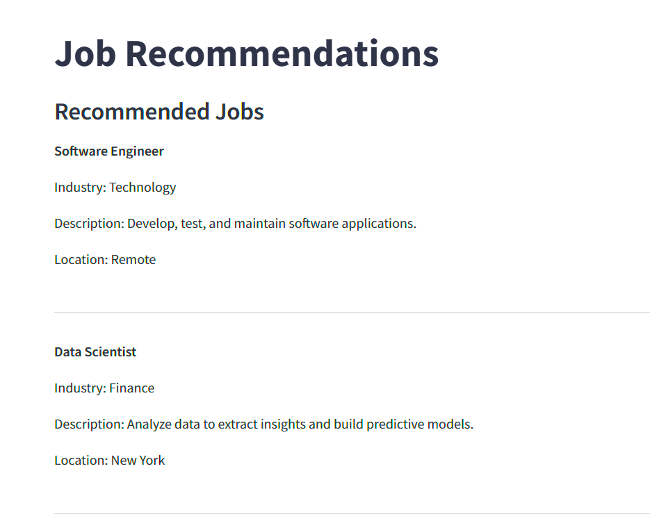
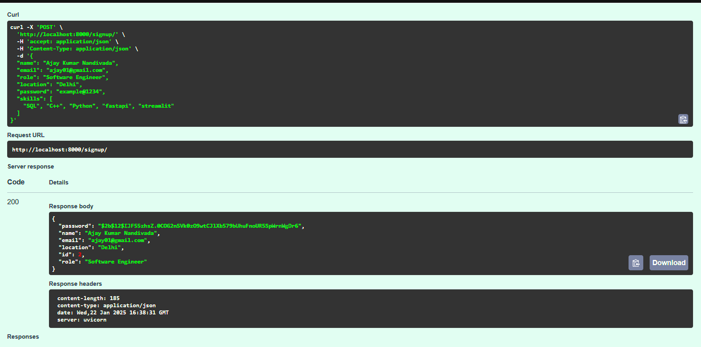
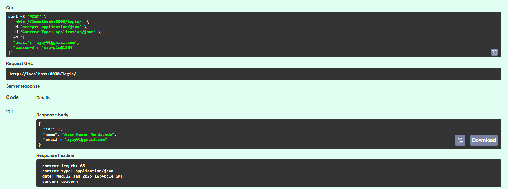
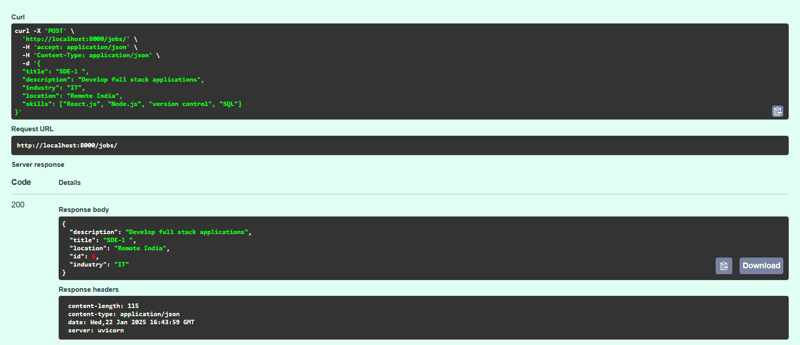
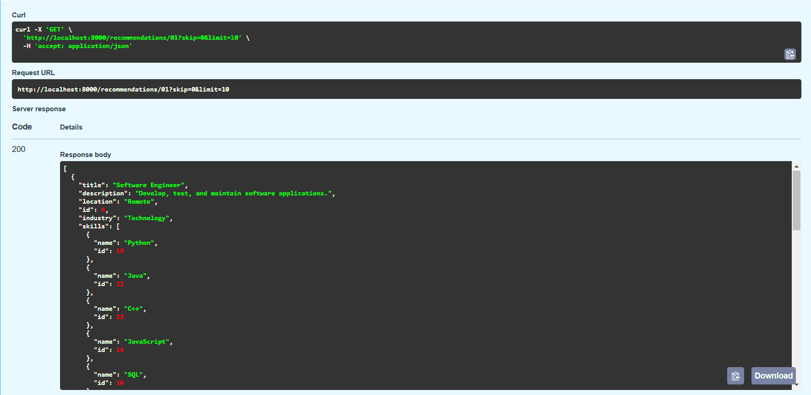
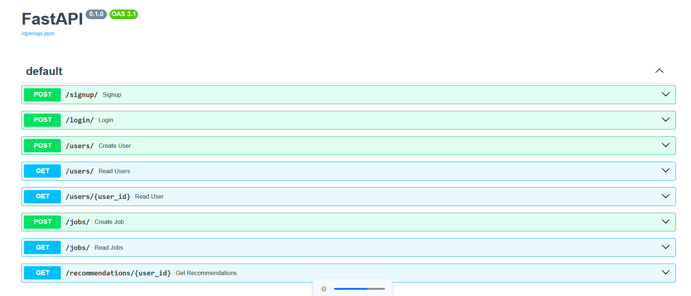

# Job Recommendation System
## Overview
The *Job Recommendation System* is a web-based application designed to provide personalized job recommendations based on user-selected skills and preferences. It consists of:

1. Backend: A FastAPI-based service for managing user data, job postings, and skill-based recommendations.
2. Frontend: A Streamlit-based user interface for interacting with the backend API.

# Prerequisites
Ensure you have the following installed on your system:

* [Python 3.8 or higher](https://www.python.org/downloads/)
* [Git](https://git-scm.com/)

---
## Video Recording

[App - Youtube Video](https://youtu.be/KtgeBP3hmzE)
[API_Testing - Youtube Video](https://youtu.be/7gQUwIdK5lk)
---
## Backend
### Features
* Home:
    
* User Management:
    * User registration and login.
    
    * Skill-based profile creation.
* Job Management:
    * Create, update, delete, and retrieve job postings.
* Job Recommendations:
    * Recommend jobs based on user skills.
    
    * Prioritize recommendations by skill match.

#### Installation Instructions
1. Clone the Backend Repository
```
git clone https://github.com/AJAYKUMAR-01/job-recommendation-system-backend.git
cd job-recommendation-system-backend
```

2. Create and Activate a Virtual Environment
```
python -m venv venv
```
For Windows:
```
.\venv\Scripts\activate
```
For macOS/Linux:
```
source venv/bin/activate
```

3. Install Dependencies
```
pip install -r requirements.txt
```
4. Set Up Environment Variables
Create a .env file in the backend/ directory and add:
```
SECRET_KEY=<your_secret_key>
DATABASE_URL=<your_database_url>
```
5. Run the Backend Server
Start the FastAPI server:
```
uvicorn app.main:app --reload
```
The server will be accessible at http://localhost:8000.

#### Backend API Endpoints
**User Management**

1. Register a User:
    * Endpoint: `POST /signup/`
    
2. Log In:
    * Endpoint: `POST /login/`
    
**Job Management**
1. Create a Job:
    * Endpoint: `POST /jobs/`
    

**Recommendations**
1. Get Job Recommendations:
    * Endpoint: `GET /recommendations/{user_id}`
    

---

## Frontend
### Features
* User Authentication:
    * Register and log in users.
* Job Recommendations:
    * Display personalized job recommendations.
* Visualization:
    * Interactive graphs showing skill-to-job mappings.
### Installation Instructions

1. Clone the Frontend Repository
```
git clone https://github.com/your-username/job-recommendation-system-frontend.git
cd job-recommendation-system-frontend
```

2. Create and Activate a Virtual Environment
```
python -m venv venv
```
For Windows:
```
.\venv\Scripts\activate
```
For macOS/Linux:
```
source venv/bin/activate
```
3. Install Dependencies
```
pip install -r requirements.txt
```

4. Run the Frontend
Start the Streamlit application:
```
streamlit run app.py
```
The application will be accessible at `http://localhost:8501`.

---

## Deployment with Docker

### 1. Build and Run with Docker Compose
Use the `docker-compose.yml` file to run both frontend and backend:
```
docker-compose build
docker-compose up
```

### 2. Access the Application
* Backend: `http://localhost:8000`
* Frontend: `http://localhost:8501`

---

## Testing
### Backend
1. Run unit tests:
```
pytest
```
2. Test APIs using the `/docs` Swagger UI.


### Frontend
1. Test user registration and login.
2. Verify job recommendations and visualizations.

---

## Future Enhancements
* Add JWT-based authentication.
* Introduce advanced job filters (e.g., location, salary).
* Enhance the visualization with analytics dashboards.

---

## Learnings
Building this project helped me grow both technically and personally. Here are some key takeaways:

1. **FastAPI Framework**:
   - Learned how to create RESTful APIs using FastAPI and handle user authentication.
   - Gained experience in setting up database models and relationships with SQLAlchemy.

2. **Streamlit for Frontend**:
   - Developed an interactive and user-friendly interface with Streamlit.
   - Integrated the frontend with the backend via API calls.

3. **Database Management**:
   - Implemented a relational database schema using SQLite.
   - Understood how to manage many-to-many relationships (e.g., users and skills).

4. **Docker**:
   - Learned how to containerize applications using Docker and orchestrate services with Docker Compose.

5. **Skill-Based Recommendations**:
   - Designed and implemented algorithms to recommend jobs based on user skills.
   - Explored strategies for ranking recommendations by relevance.

6. **Soft Skills**:
   - Improved problem-solving and debugging skills while tackling complex scenarios.
   - Enhanced my ability to research and apply new tools effectively.

---

## Challenges Faced
Building this project came with several challenges that pushed me to learn and adapt:

1. **API Integration Issues**:
   - Initially, I faced difficulties integrating the frontend and backend due to incorrect API requests.
   - Solution: Used Swagger UI to debug API calls and refined request formats in the frontend.

2. **Database Schema Changes**:
   - After introducing skills in the signup process, the database schema needed updates.
   - Solution: Used Alembic for database migrations and ensured the data remained consistent.

3. **Docker Setup**:
   - Containerizing both the backend and frontend and ensuring proper communication was tricky.
   - Solution: Researched Docker networking and updated the frontend to use the containerized backend hostname.

4. **Skill Matching Algorithm**:
   - Designing an efficient algorithm to recommend jobs based on overlapping skills was challenging.
   - Solution: Experimented with different approaches and optimized the final algorithm for scalability.

5. **User Session Management**:
   - Managing user sessions in Streamlit required additional care to maintain states across pages.
   - Solution: Leveraged `st.session_state` to store user information securely.

6. **Error Handling**:
   - Handling errors gracefully in the frontend, especially during API calls, was a recurring issue.
   - Solution: Added detailed error messages and logging for better debugging and user feedback.

Despite these challenges, each obstacle was a valuable learning experience that enhanced the quality of the project.

---

### License
This project is licensed under the MIT License.